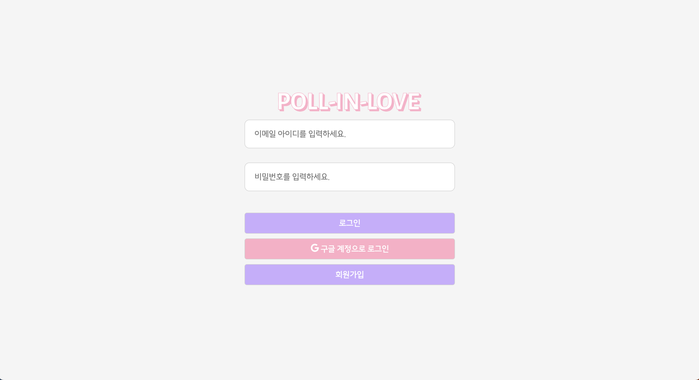
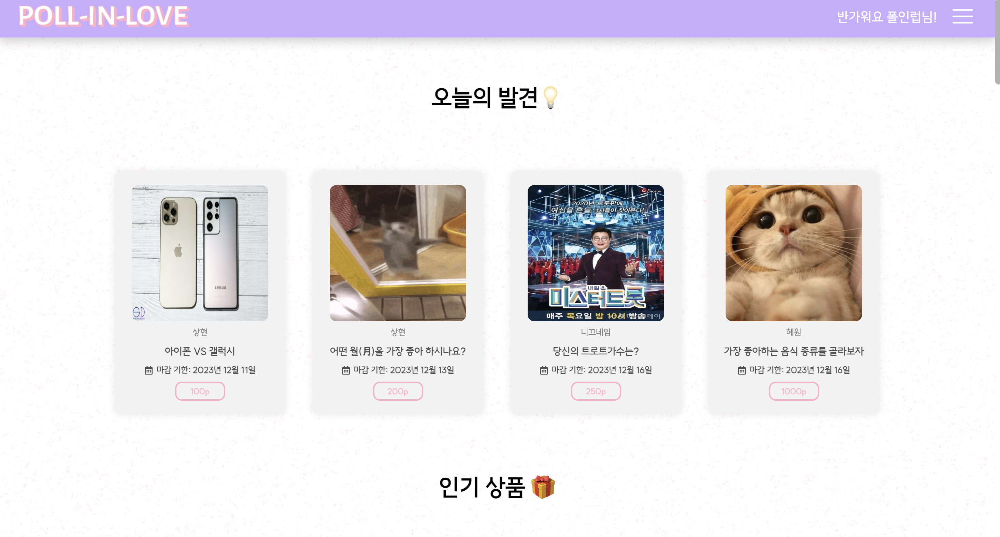
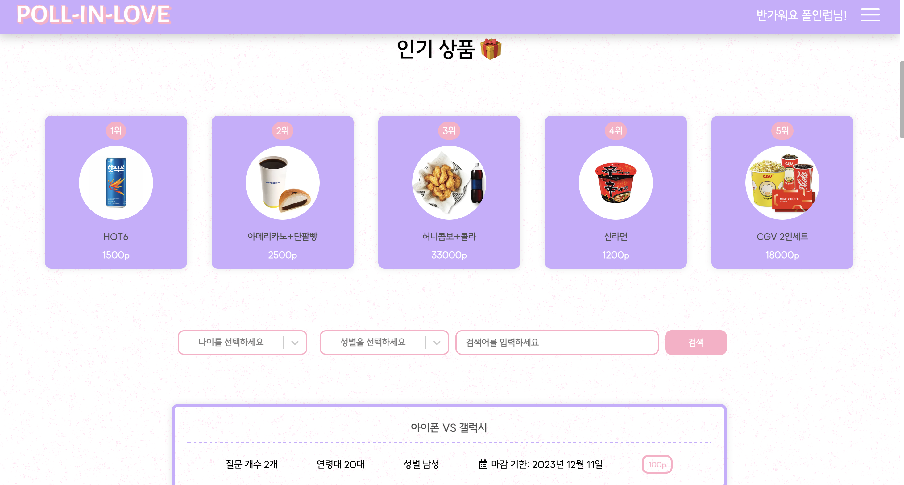
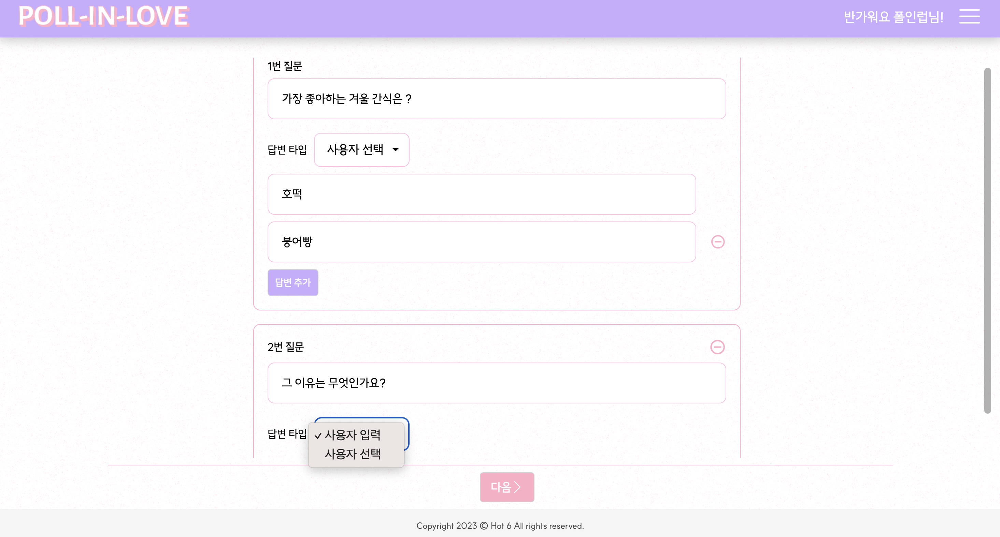
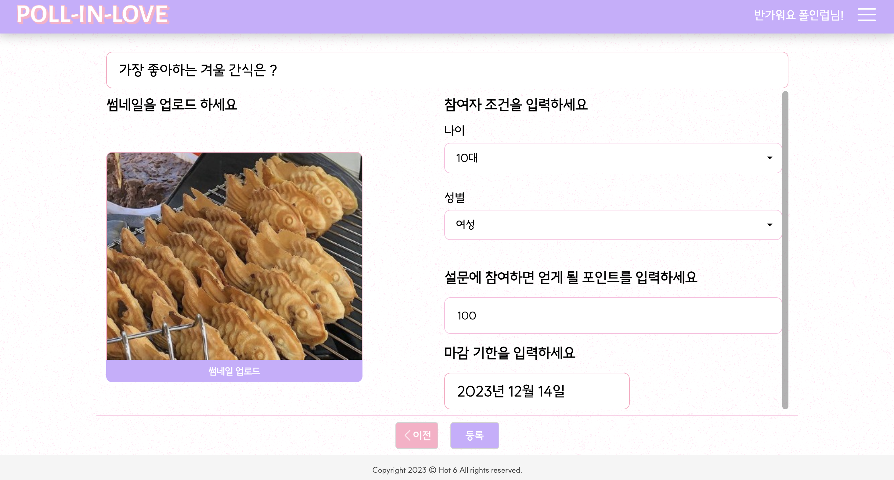
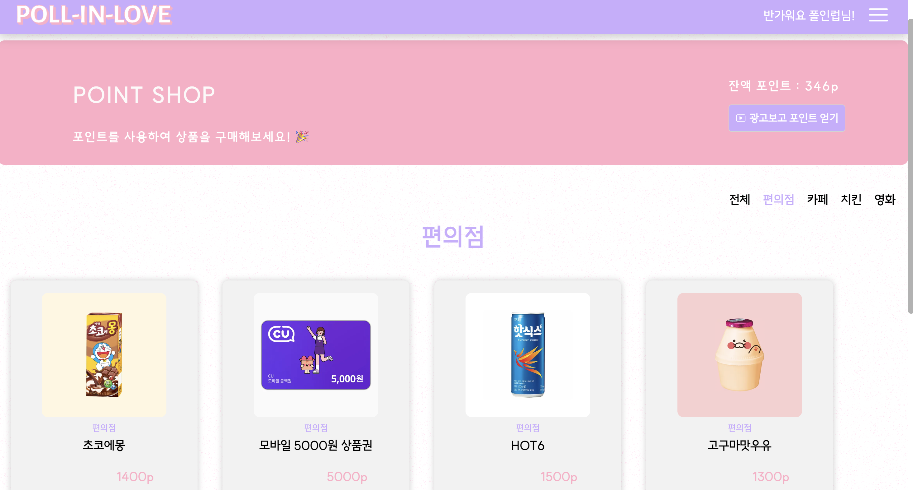
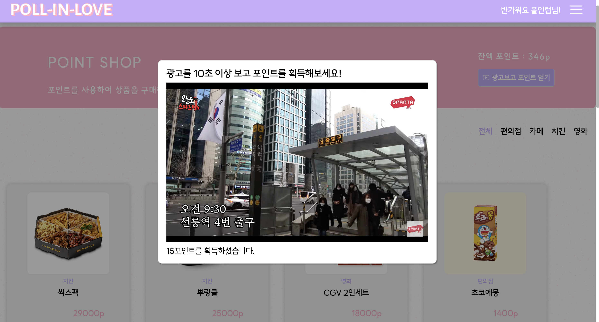
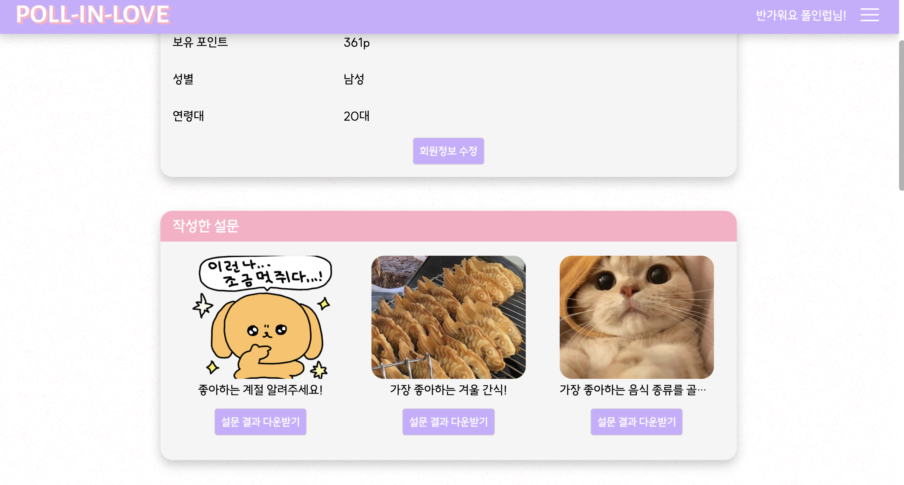

# Poll In Love

## 프로젝트 소개

- 개요 : 설문조사를 통해 세상을 더 나은 곳으로 만들어요! 설문조사로 의견을 공유하고, 포인트를 통해 이득을 얻을 수 있는 웹 서비스 입니다.
- 개발 기간 : 2023.12.5 ~ 2023.12.11

- 💌 [Poll In Love 방문하기](https://poll-in-love.vercel.app/)

## 사용 기술

### 프론트 엔드

### 서버리스 DB

### 버전 관리

### 협업 툴

## 주요 기능

### 로그인 / 회원 가입

- firebase Auth를 활용하여 로그인, 회원가입 및 소셜 로그인이 가능합니다.
  

### 메인 페이지

- <오늘의 발견> 섹션에서는 랜덤으로 설문 4개를 보여줍니다.
  

- <인기 상품> 섹션에서는 판매량이 높은 순으로 1위부터 5위까지의 상품을 보여줍니다.
- <검색> 섹션에서는 연령대, 성별, 제목으로 설문 검색이 가능합니다.
  

### 설문 등록

- 설문을 등록하는 사용자는 설문 유형에 따라 사용자 입력, 사용자 선택으로 사용자의 답변 타입을 미리 설정할 수 있습니다.
  

- 설문을 등록하는 사용자는 연령대 및 성별에 따른 참여자 조건, 참여시 지급할 포인트, 만료일 등을 설정할 수 있습니다.
  

### 포인트 상점

- 설문에 참여하는 사용자는 설문 참여를 통해 획득한 포인트를 포인트 상점에서 상품으로 교환할 수 있습니다.
  

- 유튜브 광고 보기를 통해 포인트를 얻을 수도 있습니다.
  

### 마이 페이지

- 사용자는 마이페이지에서 회원정보 수정이 가능하며, 작성한 설문에 대한 결과는 xlsx 파일로 다운로드 받을 수 있습니다.
  

## 팀원 소개

|  이름  | GitHub                        | 블로그                      |
| :----: | ----------------------------- | --------------------------- |
| 이상현 | https://github.com/4anghyeon  | https://velog.io/@sanghyeon |
| 천영륜 | https://github.com/nuny0831   | https://forme31.tistory.com |
| 한혜원 | https://github.com/hyewon-han | https://velog.io/@hw1635    |
